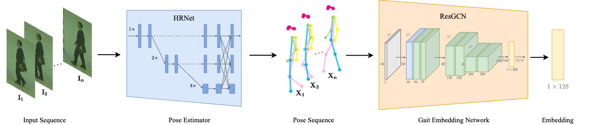

# GaitGraph: Graph Convolutional Network for Skeleton-Based Gait Recognition
This repository contains the PyTorch code for:
GaitGraph: Graph Convolutional Network for Skeleton-Based Gait Recognition
[Torben Teepe](https://github.com/tteepe), Ali Khan, Johannes Gilg, [Fabian Herzog](https://github.com/fubel)

## Quick Start
Quick Start & models coming soon!

## Main Results
Top-1 Accuracy per probe angle excluding identical-view cases for the provided models on 
[CASIA-B](http://www.cbsr.ia.ac.cn/english/Gait%20Databases.asp) dataset.

|        |    0 |   18 |   36 |   54 |   72 |   90 |   108 |   126 |   144 |   162 |   180 |   mean |
|:-------|-----:|-----:|-----:|-----:|-----:|-----:|------:|------:|------:|------:|------:|-------:|
| NM#5-6 | 85.3 | 88.5 | 91   | 92.5 | 87.2 | 86.5 |  88.4 |  89.2 |  87.9 |  85.9 |  81.9 |   87.7 |
| BG#1-2 | 75.8 | 76.7 | 75.9 | 76.1 | 71.4 | 73.9 |  78   |  74.7 |  75.4 |  75.4 |  69.2 |   74.8 |
| CL#1-2 | 69.6 | 66.1 | 68.8 | 67.2 | 64.5 | 62   |  69.5 |  65.6 |  65.7 |  66.1 |  64.3 |   66.3 |

## Licence & Acknowledgement
GaitPose itself is released under the MIT License (see LICENSE).

The following parts of the code are borrowed from other projects. Thanks for their wonderful work!
- Object Detector: [eriklindernoren/PyTorch-YOLOv3](https://github.com/eriklindernoren/PyTorch-YOLOv3)
- Pose Estimator: [HRNet/HRNet-Human-Pose-Estimation](https://github.com/HRNet/HRNet-Human-Pose-Estimation)
- ST-GCN Model: [yysijie/st-gcn](https://github.com/yysijie/st-gcn)
- ResGCNv1 Model: [yfsong0709/ResGCNv1](https://github.com/yfsong0709/ResGCNv1)
- SupCon Loss: [HobbitLong/SupContrast](https://github.com/HobbitLong/SupContrast)
